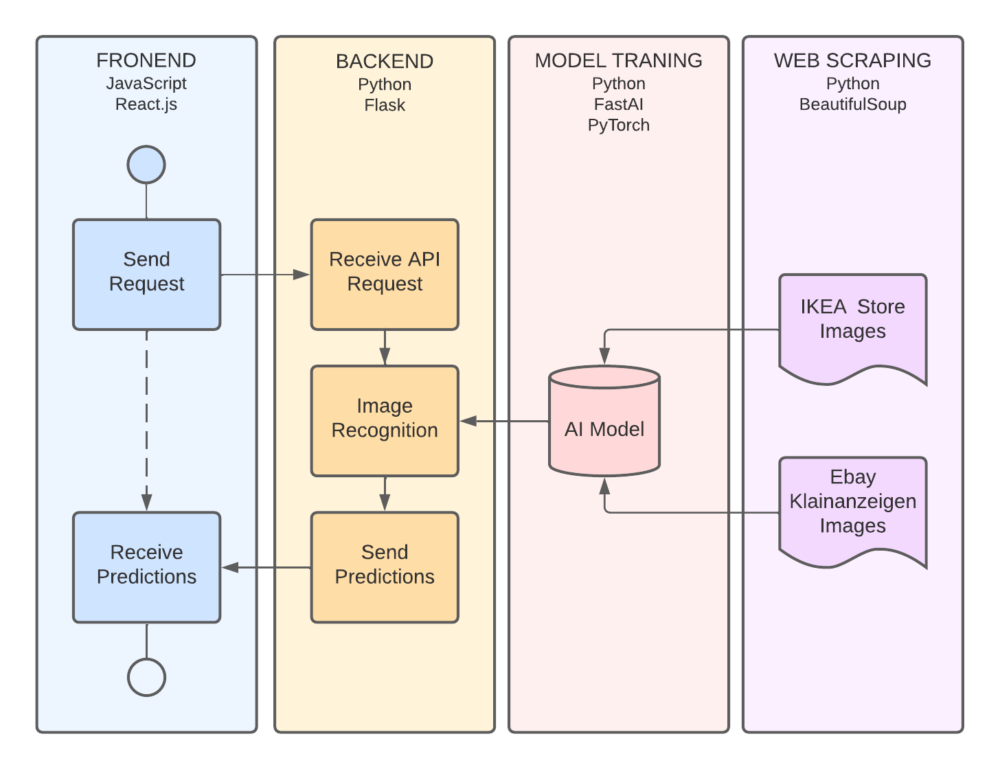

<!-- PROJECT LOGO -->
 

 
  <h3 align="center">IKEA_Products_Recognition_AI</h3>

  

   Research on training a neural network model for IKEA store product recognition
  

<!-- ABOUT THE PROJECT -->
### About The Project

Research on the training capabilities of a neural network model is an indigenous part of the final thesis at HTW Berlin. As a result of this research we were able to create a model that recognizes IKEA store furniture with an accuracy of over 90%. 
The model used in the IKEA_classifier application is part of the final project.

This work can be seen here: [Development of a web application for the recognition 
of IKEA products based on neural networks](https://docs.google.com/document/d/1APf5llBDAKWvc0GtJMNoXp0jBHCsVX-7/edit?usp=sharing&ouid=111051527142046808483&rtpof=true&sd=true)

The content of the entire work is divided into separate repositories:
1. Data acquisition
    - [Web Scraping from IKEA webstore](https://github.com/Greqorian/IKEAcom_Image_Scraper)
    - [Web Scraping from eBay Kleinanzeige.de](https://github.com/Greqorian/Ebay_Kleinanzeige_Image_Scraper)
3. Neural network model training
    - [Model training](https://github.com/Greqorian/IKEA_Products_Recognition_AI)
5. Service API to support the model
    - [Backend service API](https://github.com/Greqorian/IKEA_classifier)
7. Application front-end 
    - [frontend application in React](https://github.com/Greqorian/IKEA_classifier_frontend) 

### Neural Network Model

In the first stage, the web scraping technique was used to acquire image data from two sources, which opened the possibility of achieving higher accuracy of the trained model. Seven trainings of the neural network model were performed, gradually increasing its ability to recognize different products from the IKEA store. By the seventh stage, it was possible to train the network model to recognize 100 product classes with an accuracy of 94%. This model was implemented in an application structured with an API service and frontend implemented on cloud services. 

The results of all tests summarized in the table:

| Research number | Product classes | Number of images | Accuracy achieved | Time consumed |
|-----------------|-----------------|------------------|-------------------|---------------|
| 1               | 5               | 25               | 71%               | 0,0013 h      |
| 2               | 5               | 805              | 97%               | 0,7 h         |
| 3               | 30              | 282              | 73 %              | 0,13 h        |
| 4               | 30              | 3660             | 95%               | 2,33 h        |
| 5               | 100             | 940              | 71%               | 0,5 h         |
| 6               | 100             | 10192            | 94%               | 8,5 h         |
| 7               | 1000            | 92301            | -                 | ~ 39 h        |

### How to use

To start training the model go to the Jupyter notebook in [Google Colab](https://colab.research.google.com/drive/1jhhUAAyvhcrYKz5Nrt9Mt_iQ_qY-LK1s?usp=sharing) and follow the instructions.

### Built With

| Technology                                                               | Web Scraping | Neural Network Training | API Service | Frontend App |
|--------------------------------------------------------------------------|--------------|-------------------------|-------------|--------------|
| [Google Colab](https://colab.research.google.com/)                       | x            | x                       |             |              |
| [Python](https://www.python.org/)                                        | x            | x                       | x           |              |
| [BeautifulSoup](https://www.crummy.com/software/BeautifulSoup/bs4/doc/#) | x            |                         |             |              |
| [FastAI](https://www.fast.ai/)                                           |              | x                       | x           |              |
| [PyTorch](https://pytorch.org/)                                          |              | x                       |             |              |
| [Flask](https://flask.palletsprojects.com/en/2.0.x/)                     |              |                         | x           |              |
| [onRender](https://render.com/)                                          |              |                         | x           |              |
| [React](https://reactjs.org/)                                            |              |                         |             | x            |
| [JavaScript](https://www.javascript.com/)                                |              |                         |             | x            |
| [Sass](https://sass-lang.com/)                                           |              |                         |             | x            |
| [Heroku](https://www.heroku.com)                                         |              |                         |             | x            |

<!-- CONTACT -->
### Contact

Gregor Pawlak - [linkedIn](https://www.linkedin.com/in/grzegorz-pawlak/) 

Project Link: [https://github.com/Greqorian/IKEA_Products_Recognition_AI](https://github.com/Greqorian/IKEA_Products_Recognition_AI)
